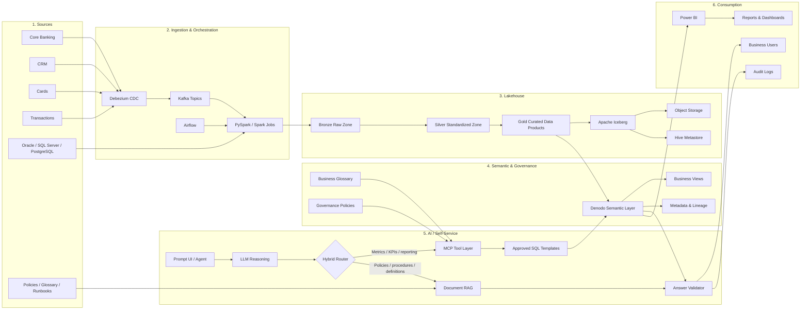

# Mermaid Architecture Diagram

```mermaid
flowchart LR
  subgraph S["1. Sources"]
    Core["Core Banking"]
    CRM["CRM"]
    Cards["Cards"]
    Txn["Transactions"]
    DBs["Oracle / SQL Server / PostgreSQL"]
    Docs["Policies / Glossary / Runbooks"]
  end

  subgraph I["2. Ingestion & Orchestration"]
    Debezium["Debezium CDC"]
    Kafka["Kafka Topics"]
    Airflow["Airflow"]
    SparkETL["PySpark / Spark Jobs"]
  end

  subgraph L["3. Lakehouse"]
    Bronze["Bronze Raw Zone"]
    Silver["Silver Standardized Zone"]
    Gold["Gold Curated Data Products"]
    Iceberg["Apache Iceberg"]
    Storage["Object Storage"]
    Metastore["Hive Metastore"]
  end

  subgraph G["4. Semantic & Governance"]
    Denodo["Denodo Semantic Layer"]
    Views["Business Views"]
    Glossary["Business Glossary"]
    Policy["Governance Policies"]
    Lineage["Metadata & Lineage"]
  end

  subgraph A["5. AI / Self-Service"]
    Prompt["Prompt UI / Agent"]
    LLM["LLM Reasoning"]
    Router{"Hybrid Router"}
    MCP["MCP Tool Layer"]
    SQLTemplates["Approved SQL Templates"]
    DocRAG["Document RAG"]
    Validator["Answer Validator"]
  end

  subgraph C["6. Consumption"]
    PowerBI["Power BI"]
    Reports["Reports & Dashboards"]
    Users["Business Users"]
    Audit["Audit Logs"]
  end

  Core --> Debezium
  CRM --> Debezium
  Cards --> Debezium
  Txn --> Debezium
  DBs --> SparkETL
  Debezium --> Kafka
  Kafka --> SparkETL
  Airflow --> SparkETL
  SparkETL --> Bronze --> Silver --> Gold
  Gold --> Iceberg
  Iceberg --> Storage
  Iceberg --> Metastore
  Gold --> Denodo
  Denodo --> Views
  Denodo --> Lineage
  Glossary --> MCP
  Policy --> MCP
  Docs --> DocRAG
  Prompt --> LLM --> Router
  Router -->|Metrics / KPIs / reporting| MCP --> SQLTemplates --> Denodo
  Router -->|Policies / procedures / definitions| DocRAG
  Denodo --> Validator
  DocRAG --> Validator
  Validator --> Users
  Denodo --> PowerBI --> Reports
  Validator --> Audit
```

